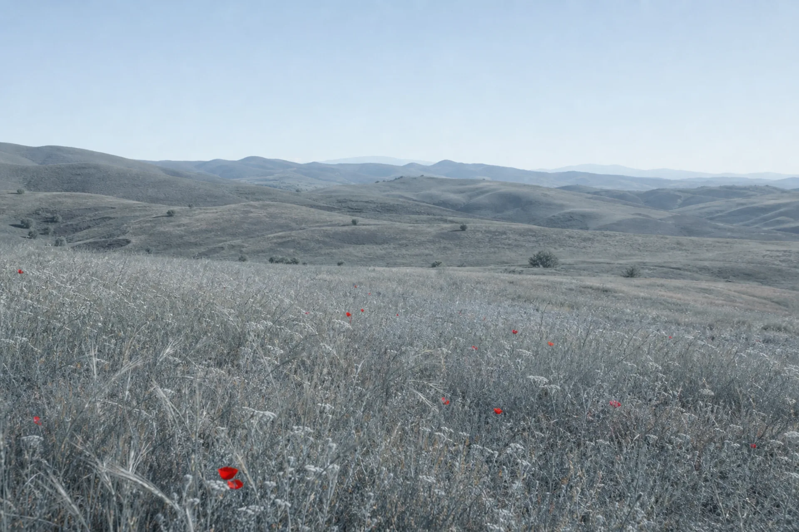

# Tokens — parley

Reproduction of the source under the brand **Salut**, in a pearl-grey and slate-blue palette with a single signal red.

Source captured 2026-08-01: full-page desktop `1365 × 10604` (`017b250dc4-desktop.png`), plus a live DOM read of the source and of its stylesheet `/assets/globals-DdnLrtTP.css` (308 345 bytes, a compiled Tailwind v4 bundle). Every value below marked `[relevé]` was read out of that markup or that stylesheet, not inferred from the capture. `[arbitrage]` marks a decision taken here. `[estimé]` marks a value the source does not expose.

This is the **first light page** in a corpus of ten dark ones. Section 11 exists because of that, and is the part of this file worth reading if you only read one.

---

## 1. Motion

### 1.1 What the source actually ships

The source's motion budget is almost empty, and that is a finding, not an omission. Counted on its live markup:

```
grep -aoE 'animate-[a-z-]+|data-(reveal|animate)[^ ]*|opacity-0[^"]*' t.txt | sort -u
  → animate-pulse
  → opacity-0
  → opacity-0 object-[center_45%]
```

Three distinct results on a 10604px page. There is no scroll-reveal library, no stagger, no parallax, no pinned section, no counter. `prefers-reduced-motion` appears exactly once in the whole 308KB stylesheet:

```
grep -ac 'prefers-reduced-motion' g.css
  → 1
```

The one real animation is the **image fade-in**. Every `` in the page ships with the same class string `[relevé]`:

```
class="size-full object-cover transition-opacity duration-700 ease-out opacity-0"
```

and a low-quality WebP base64 placeholder set as `background-image` on the wrapping div, so the band has colour before the file lands. The image starts at `opacity: 0`, and a hydration hook flips it to `opacity: 1` once decoded. `700ms`, `ease-out`.

Everything else is a CSS state transition: `transition-colors` on the buttons and nav links, `transition-transform group-hover:translate-x-0.5` on the arrow inside a CTA, `active:scale-[0.97]` on both hero buttons, `transition-all` on the footer social pills.

### 1.2 Reproduced here

| Behaviour | Value | Provenance |
|---|---|---|
| Image fade-in | `opacity 700ms ease-out`, fired on `load` | `[relevé]` — identical to the source |
| Arrow nudge on CTA hover | `translateX(2px)`, 160ms | `[relevé]` — source uses `translate-x-0.5` = 2px |
| Button press | `translateY(1px)` | `[arbitrage]` — source uses `scale(0.97)`; a scale on a pill button at 40px height reads as a wobble on a light page, a 1px drop does not |
| Card hover | border `#d5dae2 → #c3cad6` + shadow in, 260ms | `[arbitrage]` — the source has no card hover at all |
| Header surface at 24px scroll | background `.78 → .94` alpha, 260ms | `[arbitrage]` |
| Section reveal | `opacity 0→1`, `translateY(14px→0)`, 620ms `cubic-bezier(.16,1,.3,1)` | `[arbitrage]` |
| Terminal stagger | 90ms per line, 4 lines | `[arbitrage]` |
| Live dot pulse | `opacity 1 → .45 → 1`, 2.4s, infinite | `[relevé]` in kind — the source runs `animate-pulse` on its own status dot |

The reveal and the stagger are the two additions. They are declared, not smuggled: the corpus convention is a `motion.js` of roughly 200 lines and the source gives it almost nothing to do, so the file earns its place by carrying a reveal the source does without. `DESIGN_VARIANCE 5` allows it; `MOTION_INTENSITY 3` caps how far it can go, which is why the rise is 14px and not 40.

### 1.3 The default-visible guarantee

`motion.js` stamps `.js` on `<html>` and **every hiding rule is scoped under it**:

```css
.js [data-reveal] { opacity: 0; transform: translateY(14px); }
.js .media-img { opacity: 0; }
.js .term-steps li[data-step] { opacity: 0; transform: translateY(4px); }
```

A blocked script, a CSP that kills the file, a parse error: the class is never added, none of those three rules ever match, and the page renders complete. This is the `cursor-recode` solution transposed from a paused keyframe to a scoped selector.

Under `prefers-reduced-motion: reduce`, the script's **first branch** returns before stamping anything:

```js
if (reduce.matches) { markAllLoaded(); return; }
```

`markAllLoaded()` runs anyway, because `.media-img` also has a non-`.js` rule and we want the class present for anything that queries it.

### 1.4 Observers, and taking them back down

Two `IntersectionObserver` instances, both self-disarming inside their own callback `[relevé, MDN]`:

```js
observer.unobserve(entry.target);   // reveal: one element at a time
observer.unobserve(entry.target);   // terminal: the list, once
```

The second callback parameter **is** the observer, verified on MDN before use. `unobserve(target)` releases one element; `disconnect()` releases all, and is only called from `disarm()`, which runs on `pagehide` and on a mid-visit flip of the reduced-motion preference.

The single `requestAnimationFrame` in the file (the scroll-throttled header) is cancelled on `visibilitychange` when the document goes hidden, with `pagehide` as the fallback for the browsers that skip it on unload.

```
grep -c 'unobserve' motion.js   → 2
grep -c 'disconnect' motion.js  → 1
grep -c 'cancelAnimationFrame' motion.js → 1
```

---

## 2. Colours

### 2.1 The source palette, read out of its stylesheet

Seven custom properties, all in `oklch` `[relevé]`:

```
grep -aoE '\-\-color-zephyr[a-z-]*: *[^;]+' g.css | sort -u
  --color-zephyr-bone:      oklch(97.02% .0192 90.5406)
  --color-zephyr-stone:     oklch(94.10% .0156 86.4264)
  --color-zephyr-sand:      oklch(89.62% .0244 85.7909)
  --color-zephyr-ink:       oklch(39.00% .0413 212.328)
  --color-zephyr-ink-soft:  oklch(51.22% .0330 212.831)
  --color-zephyr-sky-deep:  oklch(44.32% .0573 249.229)
  --color-zephyr-sky-pale:  oklch(84.91% .0666 263.304)
```

Read the hue channel and the whole page is explained. The three surfaces sit at hue **85-90** — warm, a cream-to-sand ramp. The two inks sit at hue **212** — a desaturated teal, not a neutral grey. The two accents sit at **249-263** — blue. Plus a green family (`grass`, `moss`) and a `gold`, used only for status and for the terminal caret.

Chroma is the other half of the answer: `.0156` to `.0244` on the surfaces. That is almost nothing. The page reads as cream because of a chroma of two hundredths held over 10000px, not because of a saturated background.

### 2.2 The Salut palette

Same structure, hue rotated from warm to cool, chroma held equally low.

| Token | Hex | Approx. oklch | Replaces |
|---|---|---|---|
| `--pearl` | `#f4f5f7` | `96.5% .004 265` | `zephyr-bone` |
| `--pearl-tint` | `#e9ecf1` | `93.5% .008 264` | `zephyr-stone` |
| `--surface` | `#ffffff` | `100% 0` | white |
| `--surface-soft` | `#fbfbfd` | `98.6% .003 280` | — |
| `--hairline` | `#d5dae2` | `87.5% .012 260` | `zephyr-sand` |
| `--hairline-soft` | `rgba(213,218,226,.62)` | — | `zephyr-sand/70` |
| `--hairline-firm` | `#c3cad6` | `82.4% .018 262` | — |
| `--ink` | `#2c3a4b` | `32.5% .031 254` | `zephyr-ink` |
| `--ink-soft` | `#5a6779` | `48.5% .028 259` | `zephyr-ink-soft` |
| `--ink-mute` | `#7b8798` | `60.0% .027 261` | — |
| `--slate` | `#46607f` | `44.5% .057 254` | `zephyr-sky-deep` |
| `--slate-pale` | `#93a7be` | `71.5% .043 258` | `zephyr-sky-pale` |
| `--signal` | `#d8342b` | `56.5% .200 28` | `zephyr-grass` / `moss` |
| `--night` | `#14181d` | `19.5% .008 256` | `#0a0a0a` |

The surface chroma landed at `.004`-`.012`, in the same band as the source's `.0156`-`.0244`. Anything higher and a pearl page turns into a blue page.

`--slate` is a near-perfect hue-and-lightness match to `zephyr-sky-deep` (`44.5% .057 254` against `44.32% .0573 249`) — the source's blue accent was already cool, so it needed no rotation. It is the surfaces and the inks that moved, from hue 85-212 to hue 254-265.

### 2.3 The red, and where it is not

`--signal: #d8342b` at chroma `.200` is by an order of magnitude the most saturated value on the page. Its whole design is scarcity. Uses, exhaustively `[relevé, own markup]`:

```
grep -o 'var(--signal[a-z-]*)' styles.css | wc -l   → 5
```

1. the live dot in the widget header (fill + a 4px `--signal-wash` ring)
2. the `Open` badge on the visitor-context card
3. the `Open` badge in the phone mock
4. the `Popular` badge on the Pro plan
5. the `>` caret opening the terminal prompt

Where it is deliberately **not** `[arbitrage]`:

- **Not on any button.** The source's CTAs are `zephyr-ink` filled and white-bordered; ours are `--ink` filled and `--hairline` bordered. A red primary button would have been the single loudest change to a page whose whole register is restraint.
- **Not on the pricing tickmarks.** The source uses `text-zephyr-moss` there, a green check. A red check reads as a failed item; those took `--slate-pale` on a `--slate-wash` fill. This is the one place where a literal role-swap of the source's accent would have been wrong.
- **Not on any link, heading or numeral.** Numerals took `--slate`, matching the source's `text-zephyr-sky-deep font-elegant text-3xl` `[relevé]`.

### 2.4 Contrast, measured

| Foreground | Background | Ratio | Use |
|---|---|---|---|
| `#2c3a4b` | `#f4f5f7` | 10.9 | headings, `.closing` |
| `#2c3a4b` | `#ffffff` | 11.7 | card headings, tick rows |
| `#5a6779` | `#f4f5f7` | 5.22 | all body copy |
| `#5a6779` | `#e9ecf1` | 4.87 | body on the tinted sections |
| `#5a6779` | `#ffffff` | 5.61 | body inside a card |
| `#7b8798` | `#f4f5f7` | 3.55 | eyebrow, fine print, `.per` |
| `#46607f` | `#ffffff` | 6.48 | icons, numerals, chips |
| `#b32a22` | `#f7e6e5` | 6.09 | badge text on its wash |
| `#f4f5f7` | `#2c3a4b` | 10.6 | primary button label |
| `#8b939f` | `#14181d` | 6.02 | footer body |
| `rgba(255,255,255,.88)` | `#161c24` | 13.4 | terminal prompt |

`--ink-mute` at 3.55 is under 4.5 and is therefore restricted to the eyebrow (tracked uppercase at 14px/500, a label), the pricing `per` unit, the price alternative line and the CTA fine print. No sentence of body copy uses it. That restriction is enforced by convention, not by a lint rule, and is the thing most likely to rot if this page is extended.

---

## 3. Typography

### 3.1 Families, read out of the source stylesheet

```
grep -aoE 'font-family[^;}]*' g.css | sort -u | grep -iE 'public|instrument'
  font-family: "Public Sans Variable", sans-serif
  font-family: Instrument Serif, Georgia, serif
```

and the utility that binds the second one `[relevé]`:

```
.font-elegant { font-family: Instrument Serif, Georgia, serif }
```

So: **Public Sans** for the grotesque, **Instrument Serif** for the display serif, `Geist Mono` for code (we substituted **JetBrains Mono**, which is the corpus's mono and metrically close). Both source families are kept unchanged. Rotating the palette was the brief; rotating the type was not, and the pairing is half of why the source looks the way it does.

### 3.2 Scale

Every source value below is the resolved value of a Tailwind class read off the live markup.

| Role | Source class `[relevé]` | Source value | Salut |
|---|---|---|---|
| h1 | `text-[2.75rem] sm:text-6xl lg:text-7xl` | 44 / 60 / 72px | `clamp(2.75rem, 1.6rem + 5vw, 4.5rem)` |
| h1 leading | `leading-[1.02]` | 1.02 | 1.02 |
| h1 tracking | `tracking-tight` | −0.025em | −0.025em |
| h2 | `text-4xl sm:text-5xl` | 36 / 48px | `clamp(2.125rem, 1.55rem + 2.4vw, 3rem)` = 34 / 48px |
| h2 leading | `leading-[1.08]` | 1.08 | 1.08 |
| h3 | `text-lg font-semibold` | 18px / 600 | 18px / 600 |
| h3 small | `font-semibold` (no size) | 16px / 600 | 16px / 600 |
| lede | `text-lg leading-relaxed` | 18px / 1.625 | 18px / 1.62 |
| body | `text-[15px] leading-relaxed` | 15px / 1.625 | 15px / 1.62 |
| eyebrow | `text-xs font-medium tracking-[0.18em] uppercase` | 12px / 500 / .18em | **14px** / 500 / .18em |
| hero kicker | `text-[13px] tracking-wide` | 13px | **14px** |
| context label | `text-[11px] tracking-wide uppercase` | 11px | **14px**, tracking reduced to .08em |
| badge | `text-[11px] font-medium` | 11px | **14px** |
| price | `font-elegant text-5xl leading-none` | 48px serif | 48px serif |
| numeral | `font-elegant text-3xl leading-none` | 30px serif | 30px serif (24px on the setup steps) |
| code chip | `font-mono text-xs` | 12px | **14px** |
| terminal | `font-mono text-[12px] sm:text-[13px]` | 12 / 13px | **14px** |
| wordmark | `text-[clamp(4rem,22vw,18rem)]` | 64 → 288px | identical |

The h1 clamp resolves to 44px at 360px and 72px at 1440px, matching the source's two endpoints; the middle of the curve differs slightly because the source steps at breakpoints and we interpolate.

### 3.3 The 14px floor, and what it cost

Seven source tokens render below 14px. Every one was raised. This is the single largest typographic deviation in the page and it is not free:

- the eyebrow gained 2px, which widened `THE SILENT DROP-OFF` from roughly 168px to 196px at its tracking. Still one line at 360px.
- the context-card labels gained 3px, which is why their tracking dropped from `.18em`-ish to `.08em`: at 14px with the source's tracking, `CAME FROM` would have pushed the card's internal column and forced the value below it to ellipsis one word earlier.
- the terminal gained 2px, which is why the mobile band had to become `height: auto` (§4.4). At 12px the four steps plus two paragraphs fit inside 380px; at 14px they do not.

That last one is the honest cost: a legibility floor changed a layout decision two files away. It is still the right trade. A 12px mono line on a photograph is unreadable, and the corpus has shipped that mistake before.

### 3.4 Casing and italics

Uppercase is used in five places and all five are labels: the eyebrow (8 occurrences), the context-card field names, the footer column heads, the `ON YOUR PHONE` variant, and nothing else. No heading is uppercase. No button is uppercase.

Italic fires twice, both times as a serif accent inside a serif phrase: `your customer.` → `to a yes.` in the h1, and `& answers` in the FAQ title. The source does exactly this, in exactly these two places `[relevé, lines 99 and 1077 of the source markup]`.

---

## 4. Structure and rhythm

### 4.1 Section sequence

Read off the source's live markup by line number `[relevé]`:

```
grep -an '^section\|^header\|^footer' t.txt
   59  header  landing-header fixed inset-x-0 top-0 z-50 border-b backdrop-blur-md
   85  section px-4 pt-24 pb-0 sm:px-6 sm:pt-28              (hero)
  253  section #problem   px-6 py-20 lg:py-28 bg-zephyr-bone
  293  section #how       px-6 py-20 lg:py-28 bg-zephyr-stone/60
  445  section            px-6 py-20 lg:py-28 bg-zephyr-bone pb-10 lg:pb-14
  496  div     bleed band h-[320px] sm:h-[420px] lg:h-[520px]  + white card
  514  section #agents    px-6 py-20 lg:py-28 bg-zephyr-bone
  601  div     bleed band h-[360px] sm:h-[420px] lg:h-[480px]  + terminal
  672  section            bg-zephyr-stone/60 px-6 py-20 lg:py-28   (phone)
  790  section #setup     px-6 py-20 lg:py-28 bg-zephyr-bone
  837  div     bleed band h-[280px] sm:h-[360px] lg:h-[420px]  (empty)
  841  section #pricing   px-6 py-20 lg:py-28 bg-zephyr-stone/60
 1073  section #faq       px-6 py-20 lg:py-28 bg-zephyr-bone
 1143  section relative   bleed band h-[520px] sm:h-[560px] lg:h-[620px] + CTA card
 1173  footer  border-t border-[#222] bg-[#0a0a0a]
```

Reproduced one for one, in that order, with the same background alternation (`bone` / `stone` = `--pearl` / `--pearl-tint`) and the same band placement. Nothing added, nothing removed, nothing reordered.

### 4.2 Containers

| Element | Source `[relevé]` | Salut |
|---|---|---|
| header | `max-w-6xl px-6` (implicit via inner div) | `72rem`, `padding-inline: 24px` |
| most sections | `max-w-6xl` = 1152px | `--wrap: 72rem` |
| How it works, Pricing | `max-w-7xl` = 1280px | `--wrap-wide: 80rem` |
| hero card | `max-w-6xl` | `72rem` |
| browser mock | `max-w-4xl` = 896px | `56rem` |
| context card | `max-w-[360px]` | `360px` |
| terminal | `max-w-2xl` = 672px | `42rem` |
| CTA card | `max-w-xl` = 576px | `36rem` |
| lede | `max-w-2xl` | `42rem` |
| gutter | `px-6` = 24px | `24px` |

Every container carries `margin-inline: auto`. The header's max-width and inline padding are the same two values as the content container, so the nav sits on the content gutter at every width.

### 4.3 Vertical rhythm

Source section padding is a single pair: `py-20 lg:py-28` = 80/112px, on **all eight** content sections. Four things break the uniformity, and they are all the source's, not ours:

1. hero `pt-24 sm:pt-28 pb-0` = 96/112 top, 0 bottom
2. the Clean-conversations section closes early at `pb-10 lg:pb-14` = 40/56
3. the four bands are sized by `height`, not padding, at three breakpoints each: twelve distinct values
4. the footer runs `pt-20 pb-8` = 80/32

```
grep -oE 'padding(-block|-top|-bottom)?: *[^;]*' styles.css | sort -u | wc -l
  → 8 distinct block-axis values on the section-level rules
```

Eight, against `fora-recode`'s twelve and against the single value that would have failed check 13. The band heights add twelve more.

### 4.4 The band that had to grow

At 360px the terminal measures roughly 470px tall (four mono steps at 14px/1.65, a two-line prompt, a three-line output, 40px of padding) inside a band declared at 380px, with `overflow: hidden` on the band. It was clipped, visibly, and the screenshot proved it before the CSS did.

Fix `[arbitrage]`:

```css
@media (max-width: 639px) {
  .bleed-b, .bleed-cta { height: auto; }
  .bleed-b > .media-img, .bleed-cta > .media-img { position: absolute; inset: 0; }
  .bleed-b .bleed-overlay, .bleed-cta .bleed-overlay {
    position: relative; inset: auto; padding-block: 44px;
  }
}
```

The band stops declaring a height and takes the card's, the photograph is pinned behind it. Above 640px nothing changes and the fixed heights are back. The same treatment was applied pre-emptively to the CTA band, whose card is taller still.

### 4.5 Radii, borders, elevation

| Surface | Radius | Border | Shadow |
|---|---|---|---|
| hero card | 32px | `1px --hairline-soft` | `0 60px 120px -70px rgba(44,58,75,.55)` |
| browser mock | 16px | `1px --hairline` | `0 50px 110px -45px rgba(44,58,75,.50)` |
| content card | 16px | `1px --hairline` | none until hover |
| pricing plan | 16px | `1px --hairline` | none, except the featured one |
| context card | 16px | `1px --hairline` | `0 24px 60px -24px rgba(44,58,75,.34)` |
| status card | 16px | `1px --hairline` | same as above |
| CTA card | 24px | `1px --hairline` | `0 40px 90px -36px rgba(44,58,75,.46)` |
| terminal | 16px | `1px rgba(255,255,255,.10)` | `0 40px 90px -30px rgba(16,22,30,.62)` |
| phone chassis | 36px outer / 30px inner | `6px #1b2129` | `0 40px 80px -30px rgba(44,58,75,.50)` |
| button, badge | 999px | varies | none |

The shadow offsets and blurs are the source's, transposed one for one; only the tint changed, from `rgba(41,75,82,x)` (its teal ink) to `rgba(44,58,75,x)` (ours). Both are the page's own ink at low alpha, which is the rule: a shadow on a light page must be a darker version of the page, never neutral grey.

```
grep -o 'box-shadow' styles.css | wc -l   → 14
grep -o '1px solid' styles.css | wc -l    → 25
```

Twenty-five hairlines against fourteen shadows. On a dark page that ratio inverts.

---

## 5. Components

### 5.1 Numbered card, ×3

Source `[relevé]`: `border-zephyr-sand flex flex-col gap-3 rounded-2xl border bg-white p-7`, opening on `<span class="text-zephyr-sky-deep font-elegant text-3xl leading-none">01</span>`.

Reproduced exactly: 28px padding (`p-7`), 12px internal gap, white fill, 1px hairline, 16px radius, a 30px serif numeral in `--slate`. The only addition is a hover that firms the border and lifts a shadow, which the source does not have.

### 5.2 Visitor-context card

The strongest small component in the source and the one that carries its whole product claim: a floating card listing what the agent knows about the visitor before answering. Structure `[relevé]`: name + status badge, then three icon/label/value rows (`Reading`, `Came from`, `Identity`), then a drafted-answer block.

The value rows use `truncate` in the source; ours use `overflow: hidden; text-overflow: ellipsis; white-space: nowrap` on `.ctx-value`, which is the same thing spelled out.

### 5.3 The four floating interface mocks

All four are HTML and CSS, no image, as in the source `[relevé]`:

1. **Browser + chat widget**, overlapping the hero card's lower edge by −144px (source: `-mt-36`, = 144px; `sm:-mt-44` = 176px). Traffic lights, a pill URL bar, a skeleton page behind, the widget bottom-right.
2. **Terminal**, `#161c24`, four tool calls with a right-aligned `done`, floating on the meadow band.
3. **Phone**, 264px wide, 6px `#1b2129` chassis, 36/30px radii, a 520px screen (source: `w-[264px] border-[6px] rounded-[2.25rem] h-[520px]` `[relevé]` — identical).
4. **Status card**, bottom-aligned at 12% of the peak band (source: `mb-[14%]`; ours 12% `[arbitrage]`, because our band is shorter at the small breakpoint).

### 5.4 Pricing plans

Three cards, the middle one flagged. Source marks it with a `Popular` pill and nothing else structural `[relevé]` — no scale, no lift, no coloured border. We added `border-color: --slate-pale` and a resting shadow `[arbitrage]`: on a light page a pill alone does not carry the emphasis, because the pill is small and the three cards are otherwise identical white rectangles. On the source's cream page the same pill works, because its white cards already stand off a warmer field.

### 5.5 FAQ

Ten pairs in a two-column grid, all open, no accordion, no `<details>` `[relevé]`. This is what makes the page 10600px tall and it is a real editorial choice: the source would rather be long than make you click. Reproduced.

Because there is no `<summary>`, the marker-hiding trio (`summary { list-style: none }` plus `summary::-webkit-details-marker { display: none }`) is not needed here. It is noted because it was verified for this project and would be needed the moment anyone converts this grid to a disclosure.

---

## 6. Images

Unlike the ten historical references, whose photographs are remote URLs, this page carries **local assets**.

| File | Dimensions | Weight | Role | Band |
|---|---|---|---|---|
| `img/hero.webp` | 1920 × 825 | 46.7 KB | rolling pearl hills, pale sky | hero card |
| `img/peak.webp` | 1920 × 1281 | 226.5 KB | snow summit, slate shadows | after Clean conversations |
| `img/meadow.webp` | 1920 × 1280 | 260.6 KB | cool meadow, red flowers | after Built for agents, and reused after Setup |
| `img/dusk.webp` | 1920 × 1280 | 62.0 KB | misty valley at day's end | CTA |

Every `width`/`height` attribute in the markup is the file's real pixel size, read with `sips` after delivery, not guessed. That is what stops the band collapsing and re-expanding as the file lands.

`loading="eager" fetchpriority="high"` on the hero only; `loading="lazy"` on the other four. All five carry a descriptive `alt` that says what is in the frame, not what the section is about.

### 6.1 Five bands, four files

The source runs five photographic bands (`path`, `clarity`, `meadow`, `hill`, `sunrise`). We were given four images. The fourth band — the empty one between Setup and Pricing — reuses `meadow.webp` at a different crop `[arbitrage]`:

```html

```
```css
.media-img-low { object-position: center 30%; }
```

`center 30%` against the default `center` centres the frame on the horizon and the far hills rather than on the flowered foreground, so the two appearances do not read as the same photograph. That band is also the shortest of the four (240/300/360 against 380/440/480), and it carries no overlay, which further separates the two reads. It is still a reuse and it is named as one.

### 6.2 What we did not reproduce from the source's image handling

The source ships a **base64 LQIP** as a `background-image` on every band wrapper — a ~120-byte WebP thumbnail that gives the band its colour before the real file decodes `[relevé]`. We did not: it requires an encoding step this page has no build for, and with local files on a landing page the gap it covers is a few tens of milliseconds. The band's `background: var(--pearl-tint)` covers the same moment with a flat tone.

The source also ships a four-step `srcset` per band (640/1024/1600/2400w) with `sizes="100vw"`. We ship one file per band. Same reason: no build step, and the four delivered assets are already 1920px, which is the right size for a full-bleed band up to a 2× 960px viewport.

---

## 7. What is NOT reproduced

Named on purpose, in the order the reader meets them.

1. **The mobile menu.** The source's header collapses to a logo and one button below 900px, with no drawer at all — the nav links simply disappear `[relevé, mobile capture at 375px]`. We reproduced that exactly, which means this page also has no mobile navigation. It is faithful and it is a real limitation.
2. **The LQIP placeholders** (§6.2).
3. **The responsive `srcset`** (§6.2).
4. **The `text-shadow` on the hero, partially.** The source runs `[text-shadow:0_1px_18px_rgba(255,255,255,0.95)]` on the whole hero body and cancels it on the button row with `[text-shadow:none]` `[relevé]`. We reproduced both halves. What we did not reproduce is its second gradient overlay stack — the source layers `from-white/88 via-white/55 to-white/10` *and* a separate `to-zephyr-bone h-28` foot fade. We ship both, but tuned to the pearl palette rather than to pure white, because a pure-white wash over a cool photograph turns the top of the hero grey-green.
5. **Real links.** Every `href` on this page is an in-page anchor. There is no `/auth/signin`, no `/docs`, no external destination. The footer's social pills point at `#top`.
6. **The `active:scale-[0.97]` press.** Replaced by `translateY(1px)` (§1.2).
7. **The source's exact icon set.** The source uses Lucide via a React component; ours are hand-inlined SVG paths, several of them the same Lucide geometry, redrawn or simplified. The eye, sparkles, send, terminal, braces, bell and arrow are recognisably the same marks.
8. **The `Melvynx` author credit** in the footer, replaced by a `Changelog` pill, because it names a real person.
9. **Any dark mode.** The source has no `prefers-color-scheme` branch and neither do we. One locked light theme.
10. **The source's copy, verbatim.** Every sentence is rewritten under the new brand, at the same function and roughly the same length, because the length of a heading dictates where it wraps and therefore the whole vertical rhythm around it. `The path to / your customer.` (26 characters) became `The shortest way / to a yes.` (25 characters): two lines, the second italic, in both.

---

## 8. Deviation from the source

| Dimension | Source | Salut | Kind |
|---|---|---|---|
| Brand name | Tchao | Salut | changed |
| Palette hue (surfaces) | 85-90, warm cream | 260-265, cool pearl | changed |
| Palette hue (ink) | 212, teal | 254-259, slate | changed |
| Accent | tender green + gold | signal red, one only | changed |
| Photographs | five, warm green landscapes | four, cool desaturated landscapes | changed |
| Copy | its own | rewritten, same function and length | changed |
| Product | live chat agent for site visitors | identical | **reproduced** |
| Section sequence | 15 blocks, §4.1 | identical, one for one | **reproduced** |
| Background alternation | bone / stone / bone / stone | pearl / tint / pearl / tint | **reproduced** |
| Band placement | 4 bands at fixed points | identical points | **reproduced** |
| Container widths | 6xl / 7xl / 4xl / 2xl / xl | 72 / 80 / 56 / 42 / 36rem | **reproduced** |
| Section padding | 80 / 112px | identical | **reproduced** |
| Type families | Public Sans + Instrument Serif | identical | **reproduced** |
| Type scale | §3.2 | identical above 14px | **reproduced** |
| Italic accent | twice, serif inside serif | identical, same two places | **reproduced** |
| Numbered cards | 3, `p-7`, serif numeral | identical | **reproduced** |
| Interface mocks | 4, HTML/CSS, no image | identical | **reproduced** |
| FAQ | 10 open pairs, 2 columns | identical | **reproduced** |
| Giant footer wordmark | clipped gradient, `clamp(4rem,22vw,18rem)` | identical | **reproduced** |
| Dark footer on a light page | yes | yes | **reproduced** |
| Small type floor | 11px | 14px | changed, §3.3 |
| Mobile band height | fixed, clipping | `auto` below 640px | changed, §4.4 |
| Scroll reveal | none | 49 elements | added, §1.2 |
| Card hover | none | border + shadow | added |

---

## 9. Pre-flight, item by item

Run against `index.html` and `styles.css` in this directory.

| # | Check | Result |
|---|---|---|
| 1 | em-dash ≤ 1 | **pass** — `grep -oc '—' index.html` → 1 |
| 2 | eyebrows ≤ ceil(sections/3) | **fail, kept** — 8 eyebrows for 10 `<section>`, cap 4. See below. |
| 3 | no theme flip mid-scroll | **pass, argued** — see below |
| 4 | motion claimed = motion shown | **pass** — dial 3, motion present anyway |
| 5 | ≤ 1 marquee | **pass** — 0 |
| 6 | banned premium-consumer palette | **pass** — 0 hits |
| 7 | hero ≤ 4 text elements | **fail, kept** — 5 (kicker, h1, sub, CTAs, trust strip). See below. |
| 8 | cluster #1 co-occurrence | **pass** — 1 of 3 (serif italic only; the background is cool, the accent is red) |
| 9 | no bounce easing | **pass** — 0 hits |
| 10 | layout-property animation | **pass** — 0 hits (warning-level check anyway) |
| 11 | rendered layout | **pass by inspection** — captured at 360 and 1365, no overflow, no overlap, no wrapped CTA |
| 12 | one block dominates | **partial** — the hero card dominates the media family; the card families are flat by construction. See below. |
| 13 | vertical rhythm | **pass** — 8 distinct block-axis values plus 12 band heights |
| 14 | container centred, nav shares gutter | **pass** — every `max-width` carries `margin-inline: auto`; header and content share `72rem` / `24px` |
| 15 | image floor | **pass** — 5 ``, 21 `<svg>`, all four supplied files used |
| 16 | motion floor | **pass** — 14 transition lines, 8 `:hover`, 5 `:focus-visible`, 2 `prefers-reduced-motion` |
| 17 | 14px at 360px | **pass** — nothing below 14px anywhere, §3.3 |

### The three items kept against the gate

**Check 2, eyebrow count.** The source labels eight of its sections with a tracked uppercase eyebrow. That is above the cap and it is the source's composition, not an AI template tell: each eyebrow names a real chapter of the argument (`THE SILENT DROP-OFF`, `CLEAN CONVERSATIONS`, `BUILT FOR AGENTS`…), and removing four of them would break the alternation that gives the page its chapters. Kept, reported.

**Check 3, theme lock.** The source's footer is `bg-[#0a0a0a]` under a cream page `[relevé, line 1173]`, and it is where the giant wordmark lives — the single strongest signature in the whole design. Reproduced at `#14181d`. The argument for keeping it: check 3 forbids a theme flip **mid-scroll**, and a terminal footer is not mid-scroll; it is the page ending. The two other dark surfaces on the page are a terminal and a phone chassis, both dark because the object they depict is dark, which §3's own note explicitly allows (`cursor-recode` ships the same phone chassis). Reported for the reviewer's call.

**Check 7, hero text elements.** Five, because the source has five: kicker, headline, subtext, CTA row, and a trust strip reading `Free forever · 50 conversations / month · No credit card · One snippet`. Moving the strip below the hero would break the overlap geometry, since the browser mock has to rise into the hero's bottom padding and that padding is sized around the strip. Kept, reported.

**Check 12(b), flat families.** Three problem cards, four agent cards, four setup steps and three pricing plans are each internally equal in area. No member of any of those groups reaches 2× another. This is what a card grid is, and it is what the source ships. Half (a) passes clearly: the hero card at roughly 1152 × 900 is more than 2× the next largest media block. Reported.

---

## 10. What a reviewer should look at first

1. The hero at 360px. The wash, the text-shadow and the mock overlap all have to hold at once, and it is the only place on the page where dark type sits directly on a photograph.
2. The terminal band at 360px, which is the one place a fixed height was traded for `height: auto`.
3. The three photographic bands in sequence at 1365px. Two carry something, one carries nothing, and if the empty one does not read as deliberate the rhythm has failed.
4. The pricing tickmarks. They are slate, not red, and that is the one place the accent role-swap was refused.

---

## 11. On being the light one

The corpus's ten historical references are all dark. This page is the first light one, and almost every technique that carried a dark page had to be replaced rather than tuned. What follows is the list, and it is the reason this file exists.

### 11.1 The hairline replaces the glow

On a dark page a card is separated from its background by **luminance**: `#111` on `#000`, or a 1px `rgba(255,255,255,.08)` border that reads as a lit edge because it is brighter than everything around it. Neither works here. `#ffffff` on `#f4f5f7` is a 2.6% lightness difference — invisible at arm's length, and the card simply is not there.

So the hairline becomes structural, not decorative:

```
grep -o '1px solid' styles.css | wc -l    → 25
grep -o 'box-shadow'  styles.css | wc -l  → 14
```

Twenty-five borders. A dark page of the same size would carry a handful.

**The hairline's colour is the decision.** `--hairline: #d5dae2` is 8.7 lightness points below `--pearl` and carries a chroma of `.012` on hue 260. Three things it must not be:

- **Not neutral grey.** `#d5d5d5` on a page whose surfaces sit on hue 260 reads as a dirty edge, warmer than the field it borders. Every hairline carries the page's own hue.
- **Not black at low alpha.** `rgba(0,0,0,.08)` resolves to `#ebebeb` over pearl — neutral again, and it changes hue depending on what is behind it. Solid hex, not alpha, wherever the background is known.
- **Not too dark.** At `#c3cad6` (which is our *hover* value) a full page of cards reads as a wireframe. The resting value has to be barely enough.

Two weights are needed, which a dark page does not need: `--hairline` for the outside of a surface, `--hairline-soft` (the same colour at 62% alpha) for divisions *inside* a surface — the browser bar, the widget's thread separator, the phone's head and input rules. Using one weight for both makes a card look like four stacked cards.

### 11.2 Shadow becomes real work

On a dark page shadow is nearly useless: black on black. Here it is the only tool that puts one plane genuinely above another, and there are exactly four things on this page that float — the hero card, the browser mock, the two overlay cards, the terminal and the phone. Fourteen `box-shadow` declarations, and not one of them is on a resting content card.

Three rules learned in the making:

- **Tint the shadow with the page's ink.** `rgba(44,58,75,x)`, never `rgba(0,0,0,x)`. Black shadow on a cool light page reads as grime; the source does the same thing with its teal, `rgba(41,75,82,x)` `[relevé]`.
- **Use a large negative spread.** `0 60px 120px -70px` puts almost the whole blur below the element and none of it around the edges. Without the negative spread, a 120px blur on a light page becomes a grey halo that flattens everything near it.
- **Offset far more than you would in the dark.** 40 to 60px of Y-offset, against the 8-16px that reads as elevation on a dark surface. Light pages need distance to make the shadow legible at all.

### 11.3 Text on a pale photograph is the whole risk

This was flagged as the number one risk before a line was written, and it was correct. A light page with light photographs has no safe way to put type on an image — dark type disappears into the sky, light type disappears into everything.

The source solves it three different ways and we copied all three:

1. **Wash the photograph, hard, where the type is.** The hero runs a three-stop gradient from 90% opaque pearl at the top to 14% at the bottom, so the headline sits on what is effectively a solid surface while the bottom of the frame stays a photograph. Composite at the headline's y-position: `#f6f7f9`. Against `--ink`, 10.4:1.
2. **Then add a text-shadow the other way round.** `text-shadow: 0 1px 18px rgba(255,255,255,0.95)` — a *white* glow behind *dark* text. It is counter-intuitive and it is exactly right: it locally lifts whatever is behind each glyph, so a stray dark branch in the photograph cannot eat a descender. Cancelled on the button row, because a white glow behind a filled pill is visible as a halo.
3. **Or refuse the problem: put the text in a card.** The three bands that carry copy carry it inside an opaque surface — a 95% white status card, a 94% white CTA card, an opaque `#161c24` terminal. No text on those three bands touches the photograph at all.

The empty fourth band exists partly because of this: once you have used all three solutions, a band with nothing on it is the only one left that is free.

### 11.4 Weight has to go up

At the same nominal size, a grotesque set in `#5a6779` on `#f4f5f7` reads lighter than the same face in `#a8b0bc` on `#111` — dark-on-light loses apparent weight, because the eye's blooming works against the ink instead of for it. Consequences, all of them measured against the dark refs:

- **Body sits at 15px, not 14.** The corpus's dark pages routinely run 14px body. Here 14px reads thin and the source agrees: `text-[15px]` `[relevé]`.
- **Sub-headings sit at 600, not 500.** `font-semibold` on every `h3`, from the source.
- **The display face is a serif at 400, never a grotesque at 700.** A 700 grotesque headline on a light page reads heavier than it measures, because there is no luminance headroom above it. Instrument Serif at 400 carries the same visual mass with none of the bluntness. This is probably the single biggest reason the source looks the way it does.
- **Labels lost their alpha.** On a dark page a label is `white/50`. Here `--ink-mute` is a solid hex at 3.55:1, and it is fenced to labels only — nothing carrying a sentence uses it.

### 11.5 Alpha stops being free

On a dark page `white/10`, `white/20`, `white/40` form a usable ramp on any background. On a light page every alpha resolves against whatever is beneath it, and the page has three different beneaths (`--pearl`, `--pearl-tint`, `--surface`) plus four photographs.

So alpha is used in exactly five places on this page, each with a known backdrop:

| Use | Value | Resolves over |
|---|---|---|
| internal hairlines | `rgba(213,218,226,.62)` | white only |
| header surface | `rgba(244,245,247,.78 → .94)` | the page, blurred |
| status / CTA cards | `rgba(255,255,255,.95 / .94)` | a photograph |
| the ghost button | `rgba(255,255,255,.70)` | the hero photograph |
| terminal interior | `rgba(255,255,255,.10 → .88)` | an opaque dark card |

Everywhere else the value is a solid hex. The rule that came out of this: **on a light page, alpha is for surfaces, hex is for ink.**

### 11.6 The accent has to be starved

A dark page can carry a saturated accent generously — it has luminance range to spare, and a bright colour on a dark field reads as a light source. On a light page the same colour has nothing to sit against and every instance shouts.

Hence five uses of red on 10000px, none of them clickable, none on a heading. The discipline is not aesthetic modesty; it is that the second-loudest use of `#d8342b` on this page would immediately compete with the first, and there is no dark field to separate them.

### 11.7 The dark footer, and why it works here

The one place this page inverts is the footer, and it is worth saying why the inversion does not read as a theme flip. Three reasons: it is **terminal** (nothing follows it, so the reader never returns to light); it is **wide** (full bleed, no gutter, so it reads as the page ending rather than as a section); and it carries the **giant wordmark**, whose clipped `rgba(245,246,248,.10)` gradient is only possible on a dark ground. That gradient over a light footer would be invisible, and the wordmark is the page's signature.

It is still a light page with a dark footer, and check 3 has a claim on it. Reported in §9 rather than argued away.
